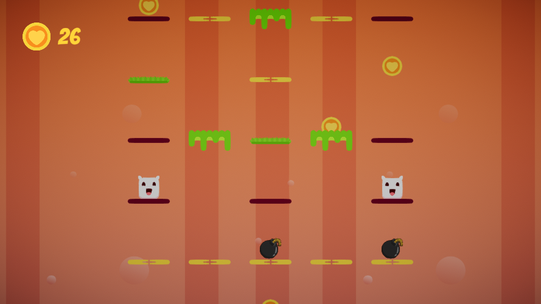
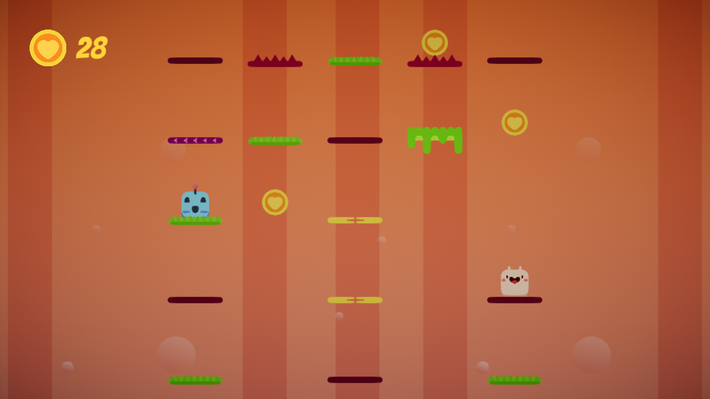

# Void

A game in Unity 2D made for internship in MarbleIT.

Unity version: 2020.3.11f1

## Release
Release build of the game can be found in ``` Build/Release/Windows ```.

## Idea
Void is a 2D semi-puzzle, semi-reaction based multiplayer game. You play as a square character called Tim, who can move in 4 directions (up, down, left and right) in a grid based world. Each grid square contains either a platform or no platform. If there is a platform, Tim can stand in that grid piece, and if not, he will fall through to the one below it. There are several types of platforms, each indicating a different kind of action that will happen to Tim, if he stands on it.

In this grid based world, Tim is faced against another Tim (other player), where they both move from one platform to another, as the platforms endlessly move in downward direction. Some platforms can contain collectibles on it, among which Tim can pick up a bomb, and place it so it can destroy other Tim (think of Mega-Bomberman). The goal of each Tim, is for other Tim to die, either by killing him with a bomb, or by letting him make a mistake and step on the wrong platform.


## Screenshots






